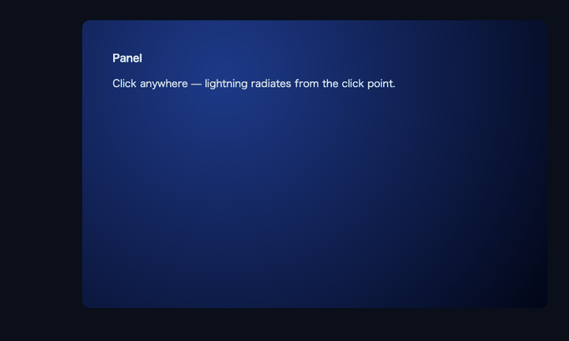

# lighting-element

Click-triggered lightning canvas effect for any DOM element.



## Repository layout

This is a bun workspaces monorepo.

- `packages/lighting-element` — the library
- `examples/example` — vanilla HTML/TS demo
- `examples/react` — React demo

## Getting started

```sh
bun install
```

Run a demo:

```sh
bun --filter lighting-element-example dev
bun --filter react-example-app dev
```

Build the library:

```sh
bun --filter lighting-element build
```

## Library usage

```ts
import 'lighting-element'
```

Add the `lighting-element` class to any element you want the effect on:

```html
<button class="lighting-element">click me</button>
```

## Scripts (root)

- `bun run eslint` — lint TS/JS sources
- `bun run stylelint` — lint CSS
- `bun run reset` — clean all node_modules and the lockfile
